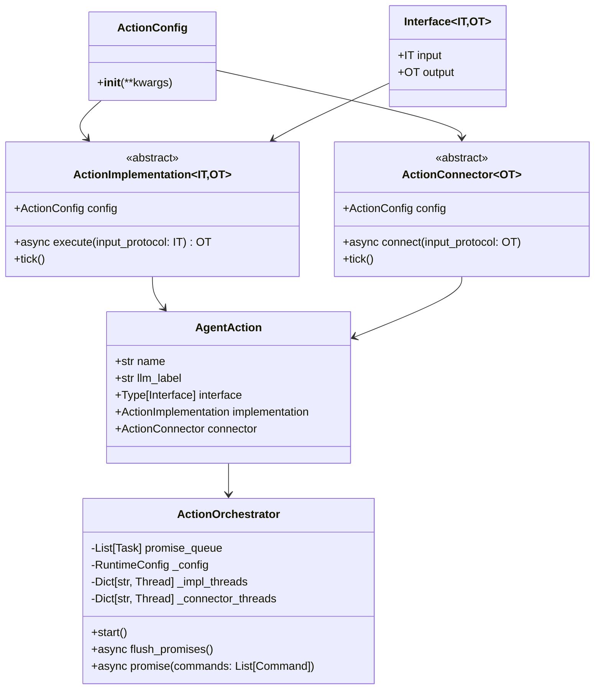
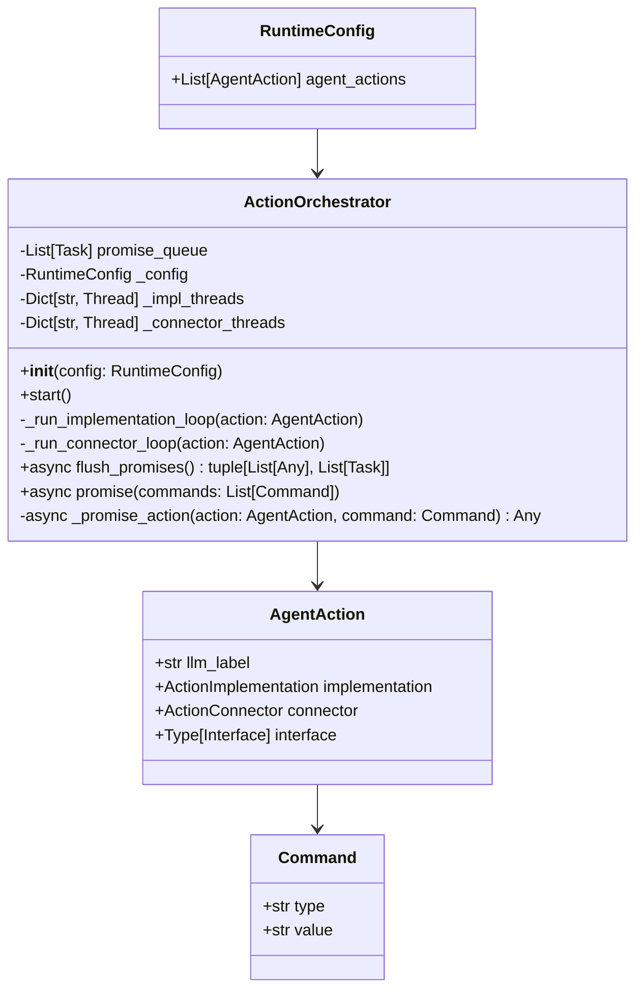

## Action Plugin Overview

The Action Plugin is a core component of OM1 that enables agents to drive robots to interact with their environment by executing commands. 
It serves as the output mechanism for the agent, translating high-level decisions from the Large Language Model (LLM) into concrete physical or digital actions 
(e.g. moving a robot, speech, etc.). This page covers the architecture of the Action Plugin, the available action types, 
and how actions are connected to different hardware and software platforms.

[github codes](https://github.com/OpenmindAGI/OM1/tree/main/src/actions)

## Action Plugin Architecture Class Diagram

Core components of the Action Plugin:



## Data Flow


## Action Orchestrator

The Action Orchestrator is the central component that orchestrates the execution of actions. It manages the states, promise queue, and threads for each action.

[github codes](https://github.com/OpenmindAGI/OM1/blob/main/src/actions/orchestrator.py)

### Orchestrator architecture class diagram



## Example configuration

```
  "agent_actions": [
    {
      "name": "move",
      "llm_label": "move",
      "implementation": "passthrough",
      "connector": "ros2"
    },
    {
      "name": "speak",
      "llm_label": "speak",
      "implementation": "passthrough",
      "connector": "ros2"
    }
  ]
```