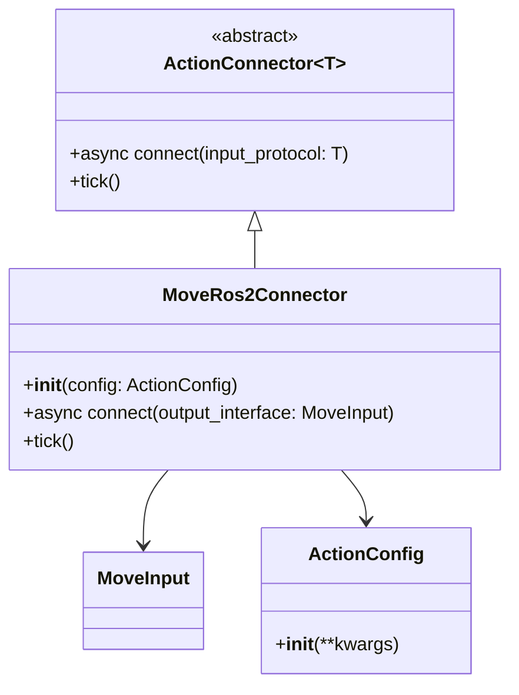
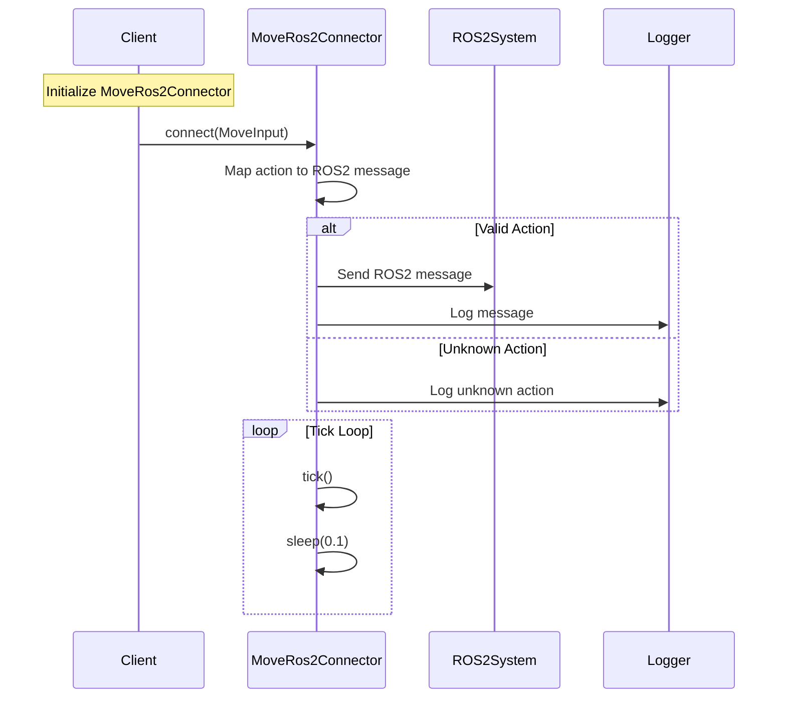

## Movement through ROS2

The Movement through ROS2 action plugin allows agents to move a robot in a simulated or real robot using ROS2.

[github codes](https://github.com/OpenmindAGI/OM1/blob/main/src/actions/move/connector/ros2.py)

## Architecture class diagram

In order to simplify the diagram, we only show the most important classes and their relationships.

## Data Flow

