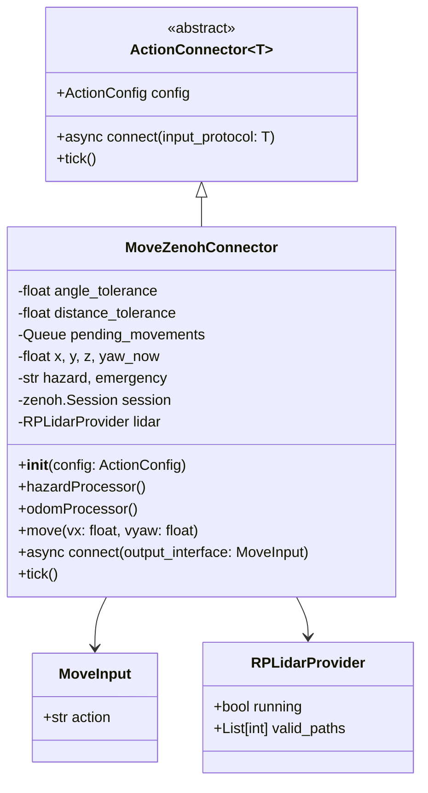
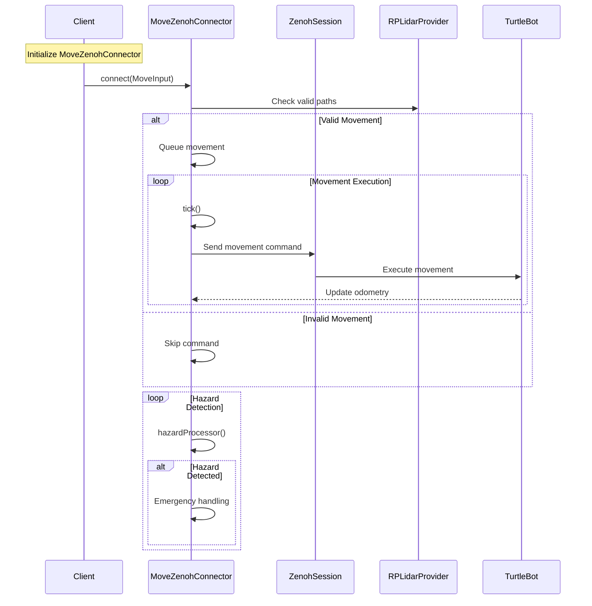

## Movement through Zenoh

The Movement through Zenoh action plugin allows agents to move a robot in a simulated or real robot using Zenoh.
In this page, we will use the [Move Turtle](https://github.com/OpenmindAGI/OM1/tree/main/src/actions/move_turtle) as an example.

## Architecture class diagram

## Data Flow

The data flow is as follows:

