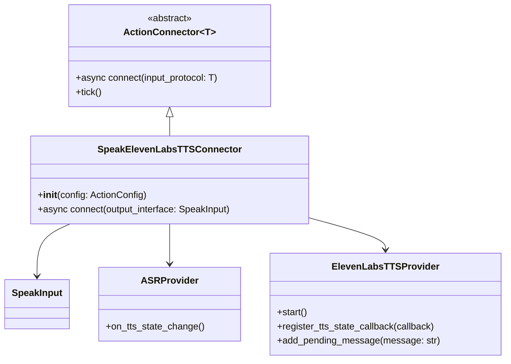
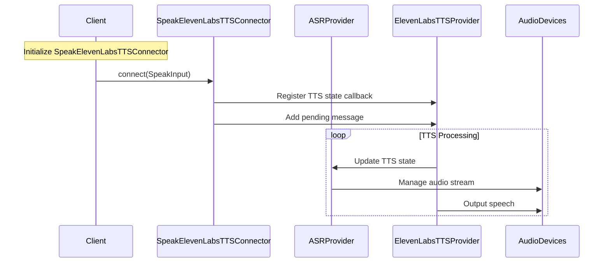

## Speech and TTS

The Speech and TTS action plugin allows agents to speak aloud with a text-to-speech (TTS) system.

[github codes](https://github.com/OpenmindAGI/OM1/blob/main/src/actions/speak/connector/elevenlabs_tts.py)

## Architecture class diagram

In order to simplify the diagram, we only show the most important classes and their relationships.



## Data Flow



## configuration parameters

```
# Example usage
config = ActionConfig(
    api_key="your_api_key",
    elevenlabs_api_key="your_elevenlabs_key",
    voice_id="custom_voice_id",
    model_id="eleven_flash_v2_5",
    output_format="mp3_44100_128",
    microphone_device_id="mic_id",
    speaker_device_id="speaker_id"
)
connector = SpeakElevenLabsTTSConnector(config)
await connector.connect(SpeakInput(action="Hello, world!"))
```

## example configuration

```
    {
      "name": "speak",
      "llm_label": "speak",
      "implementation": "passthrough",
      "connector": "elevenlabs_tts",
      "config": {
        "voice_id": "i4CzbCVWoqvD0P1QJCUL"
      }
    }
```
