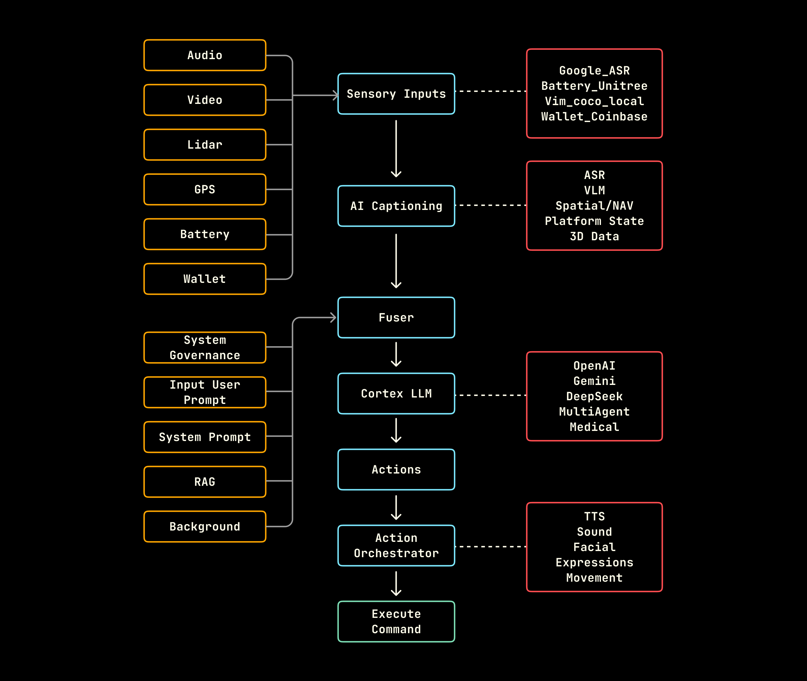

## Project Structure

```tree
.
├── config/               # Agent configuration files
├── src/
│   ├── actions/          # Agent outputs/actions/capabilities
│   ├── backgrounds/      # Background tasks
│   ├── fuser/            # Input fusion logic
│   ├── inputs/           # Input plugins (e.g. VLM, audio)
│   ├── llm/              # LLM integration
│   ├── providers/        # Background tasks
│   ├── runtime/          # Core runtime system
│   ├── simulators/       # Virtual endpoints such as `WebSim`
│   ├── zenoh_idl/        # Zenoh's Interface Definition Language (IDL)
│   └── run.py            # CLI entry point
```

The system is based on a loop that runs at a fixed frequency of `self.config.hertz`. The loop looks for the most recent data from various sources, fuses the data into a prompt (typical length ~1 paragraph), sends that prompt to one or more LLMs, and then sends the LLM responses to virtual agents or physical robots for conversion into real world actions.

Note - In addition to the core loop running at `self.config.hertz`, a robot will have dozens of other control loops running at rates of 50-500 Hz (for physical stabilization and motions), 2-30 Hz for sensors such as LIDARS and laserscan, 10 Hz for GPS, 50 Hz for odometry, and so forth. The `self.config.hertz` setting refers only the basic fuser cycle that is best thought of as the refresh rate of the robot's core attention and working memory.     

## Flow Diagram


### Sensory Input & AI Captioning
The system's perception begins with a suite of Sensory Inputs that gather data from the environment and its own internal state. These inputs are multi-modal and include:

Environmental: Audio, Video, Lidar, GPS

Platform State: Battery, Wallet

This raw data is then processed by an AI Captioning layer. This layer transforms the raw sensory streams into a structured, machine-readable format. This includes:

ASR (Automatic Speech Recognition) for audio.

VLM (Vision-Language Model) for describing video feeds.

Spatial/NAV data from GPS and Lidar.

Platform state, and 3D environmental data.

Example services for this stage include Google_ASR, Vim_coco_local for vision, and Wallet_Coinbase for financial state.

### Fuser & Cortex LLM
The Fuser is a critical component that integrates the processed sensory data from the AI Captioning layer with contextual and instructional data. This second set of inputs provides the necessary context for decision-making:

Governance: System Governance, System Prompt

User Intent: Input User Prompt

Knowledge: RAG (Retrieval-Augmented Generation), Background information

The fused, comprehensive context is then passed to the Cortex LLM, which serves as the central reasoning engine or "brain" of the system. This Large Language Model is responsible for understanding the situation, interpreting the user's intent, and formulating a plan of action. The architecture is modular, allowing for different LLMs to be used, such as OpenAI, Gemini, DeepSeek, or specialized models (MultiAgent, Medical).

### Action & Orchestration
The plan generated by the Cortex LLM is defined as a set of Actions. These high-level actions are then sent to the Action Orchestrator. This module translates the abstract plan into a series of concrete, low-level commands that can be executed by the system's hardware.

The Orchestrator manages various output modalities, including:

TTS (Text-to-Speech) for verbal responses.

Sound effects.

Facial Expressions.

Physical Movement.

Finally, the orchestrated commands are sent to the hardware layer to Execute Command, resulting in the system performing the desired action in the real world.