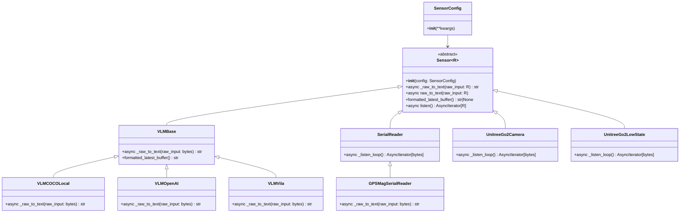
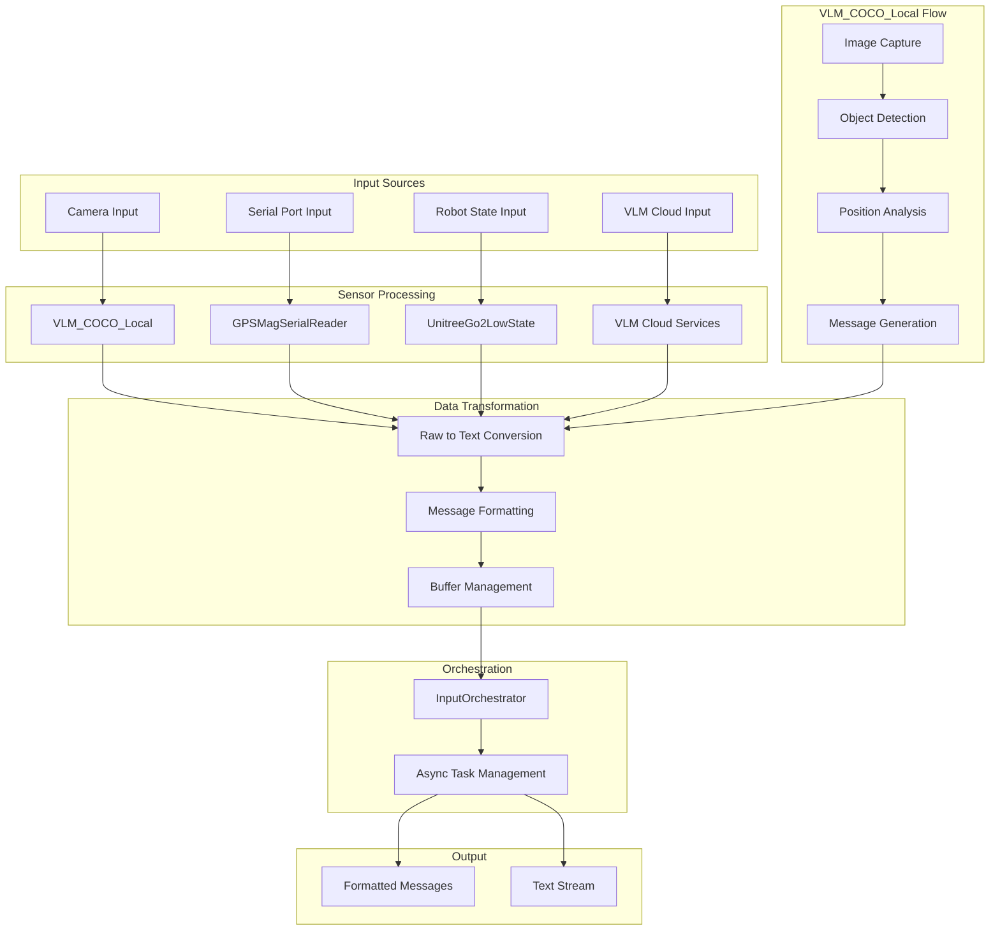

## Input Plugin Overview

The Input Plugins in OM1 provide the sensory capabilities that allow AI agents to perceive and interact with their environment. These plugins capture, process, and format various types of input data from different sources, making them available to the agent's runtime core for decision-making.

[All the input plugins codes](https://github.com/OpenmindAGI/OM1/tree/main/src/inputs)

## Input Plugin Architecture

### Classes Diagram

In order to simplify the diagram, we only show the most important classes and their relationships.

- [class `Sensor`](https://github.com/OpenmindAGI/OM1/blob/8c73b76b54d1c379998be5f75a6b04e43e6a4701/src/inputs/base/__init__.py#L23)
- [class `FuserInput`](https://github.com/OpenmindAGI/OM1/blob/8c73b76b54d1c379998be5f75a6b04e43e6a4701/src/inputs/base/loop.py#L8)

### Data Flow Diagram

## Key relationships and notes:

### Inheritance Hierarchy

- `Sensor<T>` is the base abstract class that defines the core interface
- `FuserInput<T>` extends `Sensor<T>` and implements the polling mechanism
- `VLM_COCO_Local` extends `FuserInput<T>` and implements the specific VLM functionality

### Key Components

- Uses PyTorch's `FasterRCNN_MobileNet_V3_Large_320_FPN` model
- Processes images from webcam or other sources
- Detects objects using COCO dataset classes
- Provides spatial awareness (left/right/front)

### Key Functionality

- Real-time object detection
- Spatial object localization
- Message buffering and formatting
- Webcam integration

## Other Input Plugins

- [Google ASR](https://github.com/OpenmindAGI/OM1/blob/main/src/inputs/plugins/google_asr.py)
- [Riva ASR](https://github.com/OpenmindAGI/OM1/blob/main/src/inputs/plugins/riva_asr.py)
- [RPLidar](https://github.com/OpenmindAGI/OM1/blob/main/src/inputs/plugins/rplidar.py)
- [VLM_COCO_Local](https://github.com/OpenmindAGI/OM1/blob/main/src/inputs/plugins/vlm_coco_local.py)
- [VLM_Villa](https://github.com/OpenmindAGI/OM1/blob/main/src/inputs/plugins/vlm_vila.py)
- [Arduino GPS](https://github.com/OpenmindAGI/OM1/blob/main/src/inputs/plugins/gps_mag_serial_reader.py)