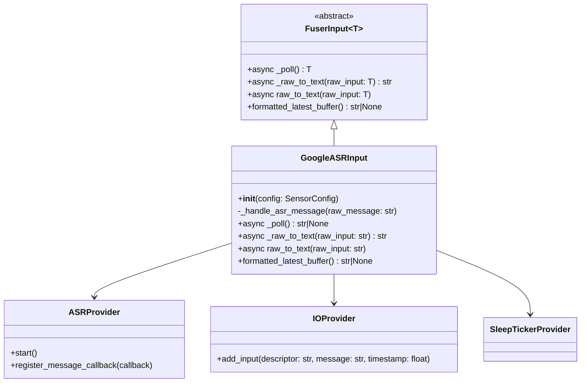
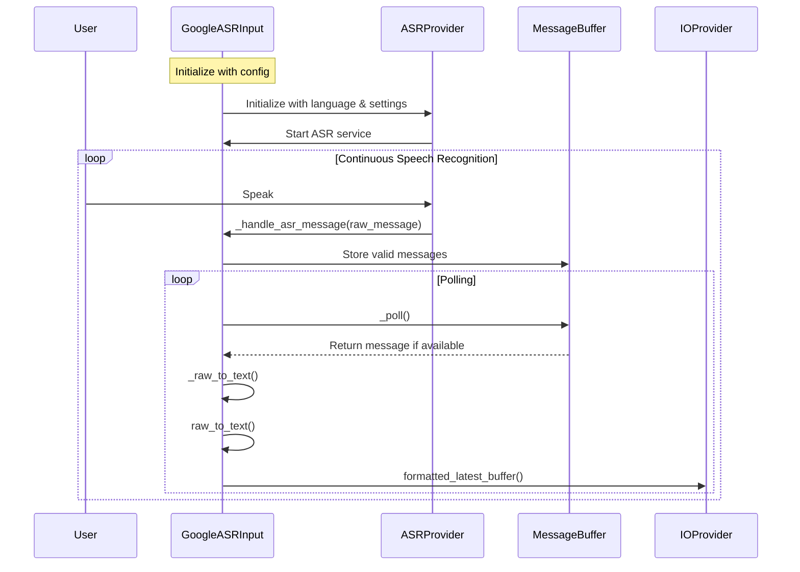

 
## Speech Recognition Input Plugin

The Speech Recognition Input Plugin in OM1 provides the ability to recognize and transcribe spoken language. This plugin captures audio input from a microphone and converts it into text, making it available to the agent's runtime core for decision-making.

## ASR Components

The ASR components are responsible for capturing audio input from a microphone and converting it into text. The main components are (take GoogleASRInput as an example):

[google asr input plugin code](https://github.com/OpenmindAGI/OM1/blob/main/src/inputs/plugins/google_asr.py)

### Class Diagram

In order to simplify the diagram, we only show the most important classes and their relationships.



### Data Flow

Speech Recognition Input Plugin Data Flow:



### Example configuration

```json agent_inputs
  "agent_inputs": [
    {
      "type": "GoogleASRInput",
      "config": {
        "language": "en-US"
      }
    }
  ]
```

### configuration parameters

Here is an example of how to configure the ASR input plugin:
```
# Example usage
config = SensorConfig(
    api_key="your_api_key",
    language="en-US",
    rate=48000,
    chunk=12144,
    microphone_name="your_mic"
)
asr_input = GoogleASRInput(config)
```
