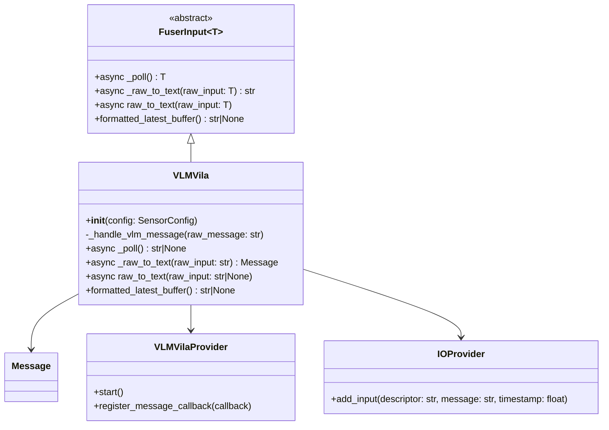
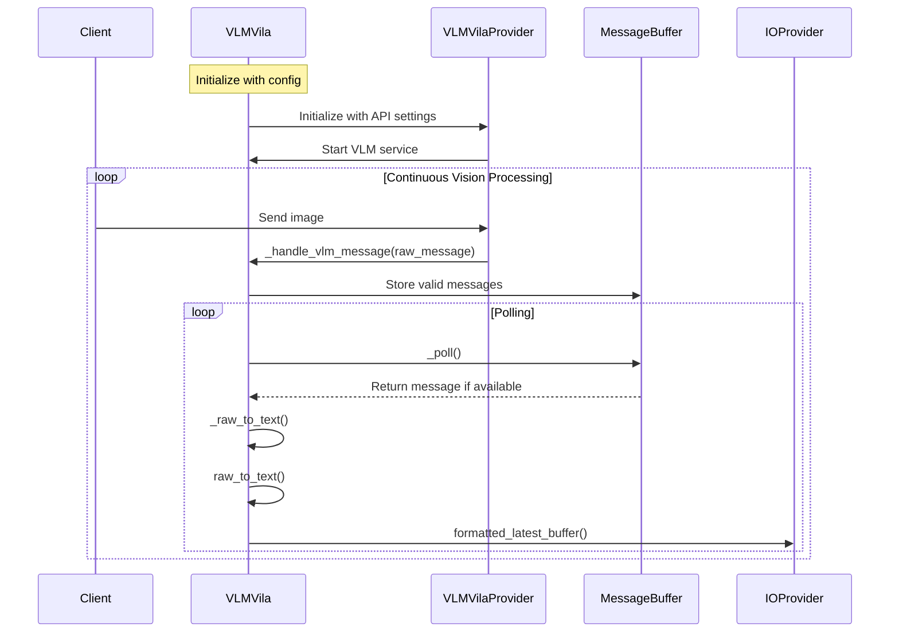

## Webcam Input Plugin

The Webcam Input Plugin in OM1 provides the ability to generate texts from a webcam. This plugin captures images from a webcam, translates into texts and makes them available to the agent's runtime core for decision-making.

Let's take VLM Villa as an example.
[VLM Villa input plugin code](https://github.com/OpenmindAGI/OM1/blob/main/src/inputs/plugins/vlm_vila.py)

## Vision Components

### Class Diagram

In order to simplify the diagram, we only show the most important classes and their relationships.



### Data Flow



### Example configuration

```json agent_inputs
  "agent_inputs": [
    {
      "type": "VLMVila",
      "config": {
        "base_url": "wss://api-vila.openmind.org"
      }
    }
  ]
```

### configuration parameters

Here is an example of how to configure the VLM Villa input plugin:

```
# Example usage
config = SensorConfig(
    api_key="your_api_key",
    base_url="wss://api-vila.openmind.org",
    stream_base_url="wss://api.openmind.org/api/core/teleops/stream"
)
vlm = VLMVila(config)
```