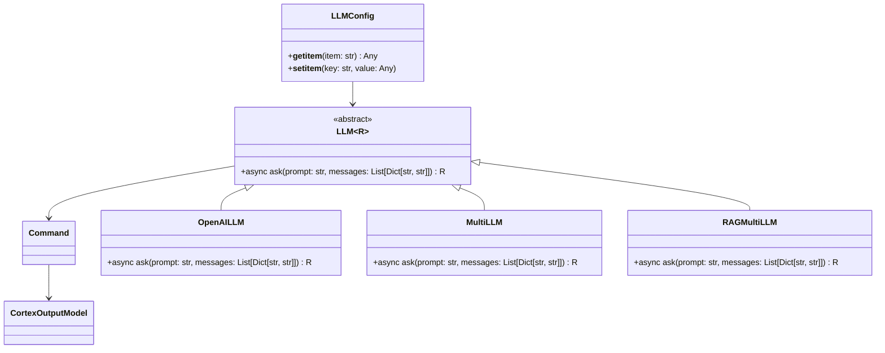
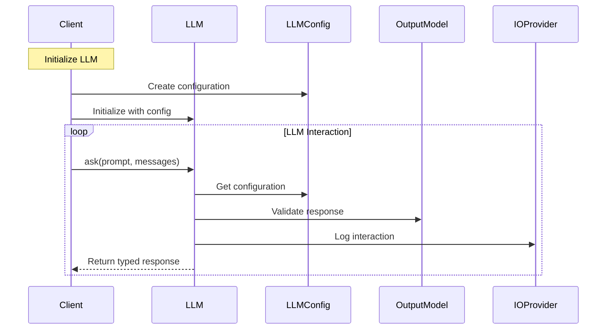

## LLM Integration

The LLM Integration in OM1 provides the ability to integrate with LLM models. This integration allows AI agents to use LLM models to make decisions and take actions.

## LLM Integration components

[github codes](https://github.com/OpenmindAGI/OM1/tree/main/src/llm)

### Class Diagram

In order to simplify the diagram, we only show the most important classes and their relationships.



### Data Flow



### Example configuration

```
  "cortex_llm": {
    "type": "OpenAILLM",
    "config": {
      "base_url": "", // Optional: URL of the LLM endpoint
      "agent_name": "Iris", // Optional: Name of the agent
      "history_length": 10
    }
  },
```