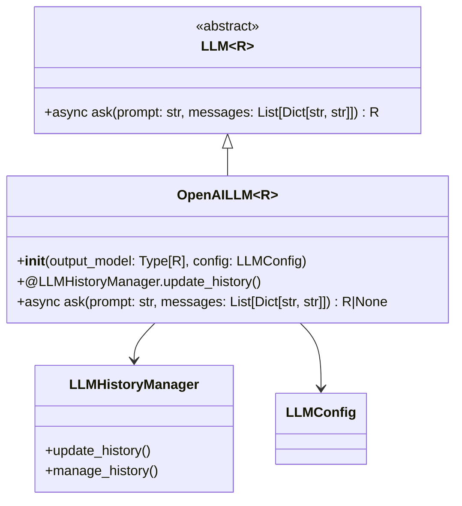
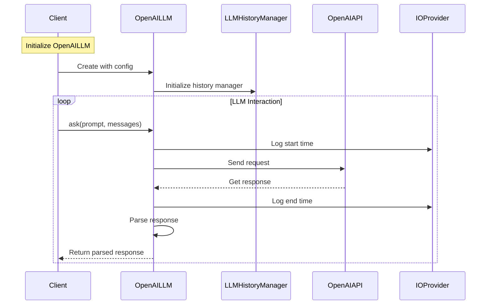

## OpenAI Integration overview

This page provides detailed information about the OpenAI integration in the OM1 system, explaining how it enables agents to leverage OpenAI's language models. 

The OpenAI integration is implemented as a plugin within OM1's LLM system, providing a standardized interface for communicating with OpenAI's language models like GPT-4. It handles authentication, API communication, prompt formatting, response parsing, and conversation history management.

[openai LLM](https://github.com/OpenmindAGI/OM1/blob/main/src/llm/plugins/openai_llm.py)

## Class Diagram

In order to simplify the diagram, we only show the most important classes and their relationships.



## Data Flow



## Example Configuration

```
  "cortex_llm": {
    "type": "OpenAILLM",
    "config": {
      "base_url": "", // Optional: URL of the LLM endpoint
      "agent_name": "Iris", // Optional: Name of the agent
      "history_length": 10
    }
  },
```
